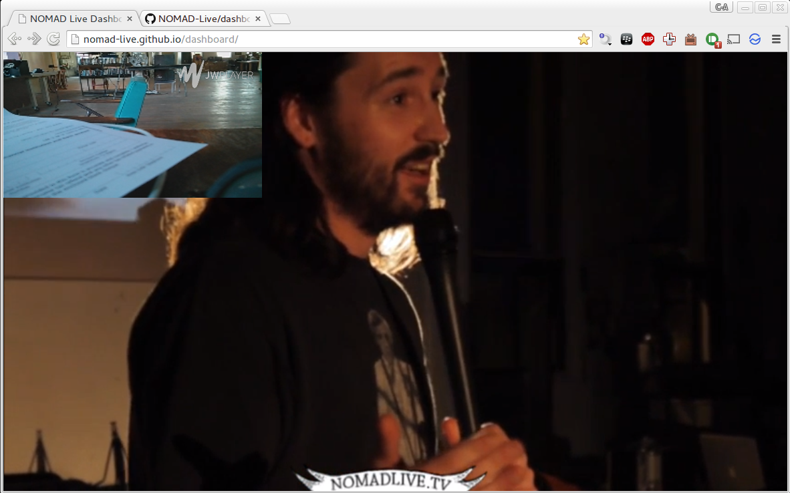

`dashboard`
===========

You can access the dashboard at http://nomad-live.github.io/dashboard/

### Usage

- Create yourself an account on Cine.IO.
- Enter the `PROJECT_SECRET_KEY` in the top right of the screen.
- Press on the `Refresh` button.

Your Cine.IO streams will start appearing on the screen.